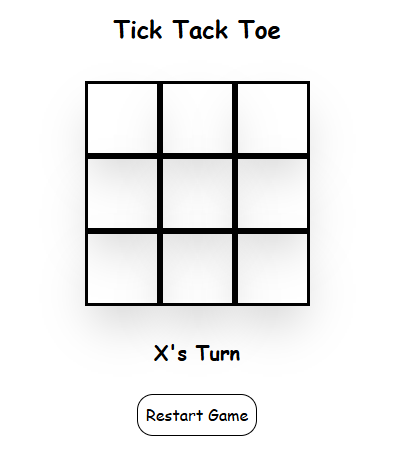

# Tic-Tac-Toe Game 🎮

A modern and responsive Tic-Tac-Toe game built with **React**, **TypeScript**, and **Tailwind CSS**, focusing on clean UI, proper state management, and strong typing.

## 🔗 Live Demo


## 📸 Screenshot



## 🛠️ Built With

- React
- TypeScript
- Tailwind CSS
- Vite

## ✨ Features

- Two-player gameplay (X vs O)
- Automatic win detection
- Draw detection
- Game reset functionality
- Responsive design for mobile and desktop
- Clean and minimal UI

## 🧠 What I Learned

- Managing component state with React hooks
- Implementing game logic with TypeScript
- Proper typing of state and props
- Structuring components for readability and reuse
- Styling efficiently using utility-first CSS (Tailwind)

## 🚀 Getting Started

To run this project locally:

```bash
git clone https://github.com/Fr1nk5sh/tic-tac-toe.git
cd tic-tac-toe
npm install
npm run dev
```
